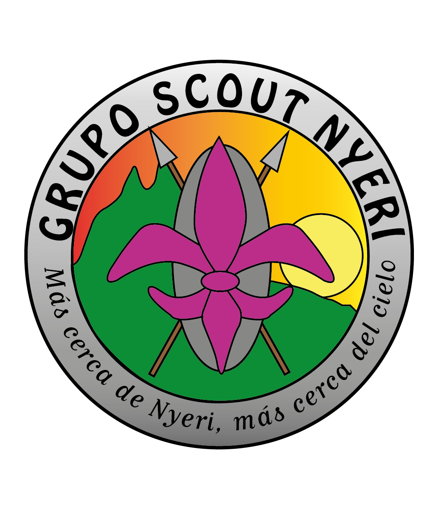

# ⚜️ Grupo Scout Nyeri | Web Project

<p align="center">
  
  <br>
  <b>"Más cerca de Nyeri, más cerca del cielo"</b>
  <br>
  <i>Sitio oficial del Grupo Scout Nyeri de Alicante, España.</i>
</p>

---

<p align="left">
  
  
  
  
</p>

## 🚀 Vision General

Este proyecto es el sitio web oficial del **Grupo Scout Nyeri**. Está diseñado para ser un hub central de información para nuevas familias, un portal de noticias (blog) y un área privada segura para la gestión de documentos y álbumes de fotos del grupo.

### ✨ Características Principales
- 🎨 **Diseño Moderno**: Interfaz limpia, accesible y totalmente responsive.
- 🌓 **Modo Oscuro/Claro**: Selector de tema inteligente integrado.
- 🛡️ **Área Privada**: Gestión de usuarios y acceso restringido vía Firebase Auth.
- 📂 **Gestión Documental**: Sincronización automática con carpetas de Google Drive.
- 📰 **Blog Scout**: Sistema de crónicas y noticias dinámico.

---

## 📂 Organización del Proyecto

El proyecto sigue una estructura limpia y categorizada para facilitar el mantenimiento a largo plazo:

```bash
GSNyeriWeb/
├── _includes/          # Componentes reutilizables (nav, footer, etc.)
├── _layouts/           # Plantillas de página (default, post, etc.)
├── _posts/             # Crónicas y noticias del blog
├── area-privada/       # 🔒 Login, Documentos y Panel de Administración
├── ramas/              # 🏕️ Secciones: Manada, Tropa, Pioneros y Rovers
├── legal/              # ⚖️ Aviso Legal, Privacidad y Cookies
├── paginas/            # 📄 El Grupo, Contacto y Galería dinámica
├── assets/             # 🎨 CSS, JS, Imágenes y Documentos públicos
├── docs/               # 📚 Documentación interna de desarrollo
└── index.html          # 🏠 Página de inicio (Landing Page)
```

---

## 🛠️ Tecnologías Utilizadas

<table align="center">
  <tr>
    <td align="center" width="96">
      
      <br>HTML5
    </td>
    <td align="center" width="96">
      
      <br>JS
    </td>
    <td align="center" width="96">
      
      <br>CSS3
    </td>
    <td align="center" width="96">
      
      <br>Jekyll
    </td>
    <td align="center" width="96">
      
      <br>Firebase
    </td>
  </tr>
</table>

---

## 📞 Contacto

**Asociación Grupo Scout Nyeri**
- 📍 San Vicente del Raspeig, España
- ✉️ [contacto.gsnyeri@gmail.com](mailto:contacto.gsnyeri@gmail.com)
- 📸 [@gruposcoutnyeri](https://www.instagram.com/gruposcoutnyeri/)

---
<p align="center">
  <i>Hecho con ⚜️ por el Grupo Scout Nyeri</i>
</p>
